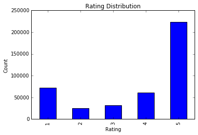
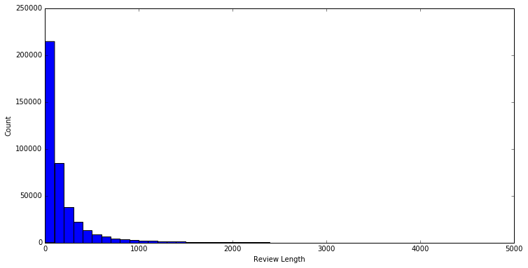
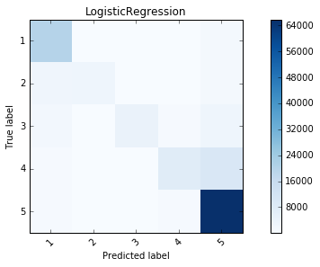
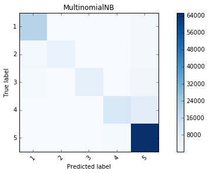
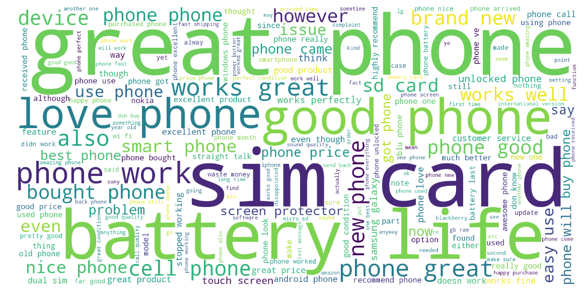

# Machine Learning Engineer Nanodegree
## Capstone Project

Garrison Jensen\
March 26th, 2017

## I. Definition

### Project Overview

Is it possible to predict the star rating of an Amazon review given the text of that review? I want to try to answer that question using a collection of 400,000 Amazon reviews of unlocked mobile phones as my dataset. I think it is interesting to see if the sentiment of a review can be decided from the text of the review itself.

The problem of determining the sentiment of text is not new. Research was done to try to extract sentiment from movie reviews [^1]. They tried to predict whether the review was positive or negative based on the text. They found that one of the main difficulties with sentiment extraction is that it requires more understanding of the text than traditional topic-based categorization. Topic-based categorization relies on finding keywords in text, however sentiment can be expressed more subtly.

[^1]: http://www.cs.cornell.edu/home/llee/papers/sentiment.home.html

### Problem Statement

The online store Amazon.com gives its users the ability review products in the form of a written review and a star rating between 1-5 stars. In this report, we try to predict the star rating given the written review.

To build our model we must complete the following tasks:

  1. Download and pre-process Amazon.com reviews of unlocked mobile phones.
  2. Extract features from the reviews.
  3. Train models to predict ratings.
  4. Refine the models.
  5. Compare/contrast final models.
  6. Discuss further possible improvements.

### Metrics

The metric we will use to measure the performance of our models is the F1-score. An F1 score is defined as follows:

$F1 = 2 \cdot \frac{precision \cdot recall}{precision + recall}$

$Precision = \frac{\text{True Positives}}{\text{True Positives} + \text{False Positives}}$

$Recall = \frac{\text{True Positives}}{\text{True Positives} + \text{False Negatives}}$

An F1-score is a popular metric to measure the performance of classifiers. An F1-score can be interpreted as a weighted average of precision and recall. [^2] The range of an F1-score is between 0 and 1, with the best score being 1.

The dataset is asymmetrical. 54% of the Amazon ratings in our dataset are five stars; this means if a model always guesses five stars it would be right 54% of the time. We don’t want to favor models that guess five stars too often. This is why we are using the f1-score as our metric; it takes both false positives and false negatives into account. Using F1 scores to evaluate our models will allow us to favor models that have both high precision and recall.

[^2]: http://scikit-learn.org/stable/modules/generated/sklearn.metrics.f1_score.html#sklearn.metrics.f1_score

## II. Analysis

### Data Exploration

It's not possible to leave a review without a rating, but it is possible to leave a rating without a review. We ignore ratings not paired with a review.

It’s also important to note that most reviews (over 50%) are 5-star reviews.  We need to take that into account when splitting our data into training and testing sets. It's important that we stratify the data, so we don't get uneven datasets. 

#### Example reviews

|Rating|Reviews|
|------|-----------------------------------------------------------------|
|2|The charging port was loose. I got that soldered in. Then needed a new battery as well. $100 later (not including cost of purchase) I have a usable phone. The phone should not have been sold in the state it was in.|
|5|I feel so LUCKY to have found this used (phone to us & not used hard at all), phone on line from someone who upgraded and sold this one. My Son liked his old one that finally fell apart after 2.5+ years and didn't want an upgrade!! Thank you Seller, we really appreciate it & your honesty re: said used phone.I recommend this seller very highly & would but from them again!!|
|4|nice phone, nice up grade from my pantach revue. Very clean set up and easy set up. never had an android phone but they are fantastic to say the least. perfect size for surfing and social media. great phone samsung|
|4|It works good but it goes slow sometimes but its a very good phone I love it|
|5|Very pleased|
|2|Phone looks good but wouldn't stay charged, had to buy new battery. Still couldn't stay charged long.so I trashed it.MONEY lost, never again will I buy from this person! !!!|
|4|Great phone to replace my lost phone. The only thing is the volume up button does not work, but I can still go into settings to adjust. Other than that, it does the job until I am eligible to upgrade my phone again.Thaanks!|
|1|I already had a phone with problems... I know it stated it was used, but dang, it did not state that it did not charge. I wish I would have read these comments then I would have not purchased this item.... and its cracked on the side.. damaged goods is what it is.... If trying to charge it another way does not work I am requesting for my money back... AND I WILL GET MY MONEY BACK...SIGNED AN UNHAPPY CUSTOMER....|


### Exploratory Visualization

\

\


### Algorithms and Techniques
### Benchmark

We are going to use sklearns implementation of logistic regression [^6] as our benchmark. This is a linear model that is capable of multiclass classification. 

For the benchmark, we are not going to do any parameter tuning. However, we will do some parameter tuning later during the refinement stage. 

```python
benchmark_linear_model = LogisticRegression().fit(X_train, y_train)
f1_score(y_test, benchmark_linear_model.predict(X_test), average='weighted')
```

[^6]: http://scikit-learn.org/stable/modules/generated/sklearn.linear_model.LogisticRegression.html

## III. Methodology

### Data Preprocessing

There are several preprocessing steps we need to take before training. First, sometimes people leave ratings without reviews. We are going to ignore empty reviews:

```python
data = data[data['Reviews'].isnull()==False]
```

Next, some of the reviews have some formatting that we want to get rid of. We also remove all characters not in the English alphabet (including punctuation) and set everything to lowercase:

```python
def clean_text(string):
    review_text = BeautifulSoup(string, "lxml").get_text()
    string = re.sub("[^a-zA-Z]"," ", string)
    string = string.lower()
    return string
```
[^3]

At this point each review is a bunch of lowercase words. Now we need to do some kind of feature extraction.

We are going to use __term frequency–inverse document frequency__ (TF-IDF)[^4] as our feature extraction strategy. TF-IDF takes into account document length and term frequency when building features. We don't want long reviews to seem more relevant just because they are long, we also don't want to overvalue words that appears many times but do not provide very much information. TF-IDF weights the words based on it's frequency in the document and the document length.

$\text{TF/IDF} = \text{Term Frequency} \times \text{Inverse Document Frequency}$

TF-IDF uses a bag of words with weights to represent a document. However, this will miss some relationships between words. For example "not good" and "very good" both contain the word "good" but one is has the inverse meaning. We can help fix this problem using the `ngram_range` option in sklearns implementation of TD-IDF. `ngram_range` allows us to set the length of words that can be considered together. Setting this correctly will take some guessing and checking.

Finally, we can look at what TF-IDF considers the most relevant phrases. 

- Top 8 most relevant phrases:
	* 'music'
	* 'verizon'
	* 'year'
	* 'gb'
	* 'happy'
	* 'great phone'
	* 'great'
	* 'got'

Great! We know we are on the right track because these phrases intuitively seem relevant.

[^3]: BeautifulSoup is a Python library for pulling data out of HTML and XML files. We are using it here to get the text from the reviews without the xml formatting. 
[^4]: http://scikit-learn.org/stable/modules/generated/sklearn.feature_extraction.text.TfidfVectorizer.html

### Implementation

We are going to try to use a logistic regression algorithm, multinomial Naive Bayes classifier, and a Stochastic Gradient Descent classifier to predict ratings. 

The logistic regression algorithms is going to be the same as our benchmark, except we are going to tune the parameters. 

We are going to use sklearn's implementation of multinomial-Naive-Bayes classifier and Stochastic-Gradient-Descent classifier. Both are fairly simple to use, the difficult part is parameter tuning. Both algorithms were chosen for performance reasons (These algorithms must run on a macbook pro with no GPU). Because our data set has a large number of features, SVM was not possible under reasonable time constraints.

Each algorithm was trained using 70% of the data (30% was saved for testing).

### Refinement

Parameter tuning was done using sklearn's GridSearchCV algorithm. GridSearchCV does an exhaustive search over specified parameter values. 

Parameter tuning on the feature extraction algorithm was just as important as tuning the learning algorithms. Modifying the ngram_range parameter made a large difference in the `F1` scores we could achieve.

## IV. Results

### Model Evaluation and Validation

During development, 30% of the data was saved for evaluating the models. The performance of these models can be evaluated through their F1-scores:

#### F-Scores

|LogisticRegression (benchmark)|LogisticRegression (Tuned model)|NaiveBayes|SGD|
|----------------|----------------|----------------|----------------|
|0.7847|0.234|0.8405|0.8612|

Another interesting characteristic of these models is the confusion matrices produced by running the models on the testing data:

#### Confusion Matrices

\

\


These confusion matrices tell us that the models have an easier time with the 5-star and 1-star reviews than the other reviews. This makes sense because 5-star and 1-star reviews are probably more distinct than than mid-level ratings. 

It's also clear from both the F1-score and confusion matrices that the stochastic gradient descent model outperforms the others.

### Justification

The final stochastic gradient descent learning model (SGDClassifier) has a F1-Score of `0.8612`, this is much better than the benchmark model which has a score of `0.7847`. We can look at the example reviews from _(Table 666)_ and see how each classifier did:


|actual|p1|p2|p3|text|
|---|---|---|---|---|
|1|1|1|1|The charging port was loose. I got that soldered i...|
|5|5|5|5|I feel so LUCKY to have found this used (phone to ...|
|1|1|5|1|nice phone, nice up grade from my pantach revue. V...|
|3|1|3|3|It works good but it goes slow sometimes but its a...|
|2|2|4|2|Very pleased|
|4|1|4|4|Phone looks good but wouldn't stay charged, had to...|
|2|1|2|2|Great phone to replace my lost phone. The only thi...|
|4|5|4|4|I already had a phone with problems... I know it s...|


## V. Conclusion

### Free-Form Visualization

#### Word Cloud

\


### Reflection

To create this model I took the following steps:

  1. The data was downloaded and cleaned.
  2. Features were extracted from the review text.
  3. The data was split into testing and training sets.
  4. A benchmark classifier was created.
  5. Several classifiers were trained against the data using automated parameter tuning.
  6. The models were tested against the testing data.
  7. The models were compared using F1-scoring as a metric.

I found feature-extraction and parameter tuning as the most difficult steps in this project. The performance of my models was not very good until I decided to use the `ngram_range` parameter in the feature extraction algorithm to extract phrases from the text rather than just words. For parameter tuning I had to research and find useful parameters and ranges to use for tuning. `SGDClassifier` performed poorly with the default `penalty` parameter, it wasn't until I added the parameter to the grid search that it started performing well.

### Improvement

A solution not explored in this report is a recurrent neural network. A good candidate would be the use of the Keras[^5] python library. Keras is a deep learning library that would be useful in building a neural network model to predict ratings.

[^5]: https://keras.io/
